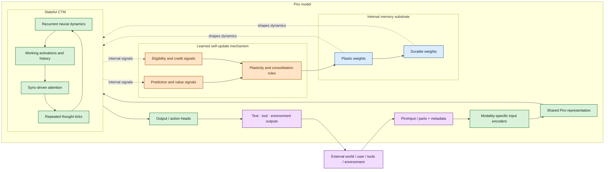

# Piro Stateful RL-First Model — v0.1

**Date:** July 20, 2026  
**Scope:** first architecture diagram for discussing state, delayed feedback,
and inference-time learning

## One-sentence thesis

Piro is a multimodal, stateful CTM whose internal weights serve as memory and
whose architecture includes the mechanism that updates those weights.

## Structural architecture

The main diagram describes what Piro is made of, rather than narrating a
particular sequence of moments. `PiroInput` is the external input boundary;
modality-specific encoders produce a shared representation; the stateful CTM
performs recurrent thought dynamics; output heads expose text, tool, and
environment actions; and the model-internal learning mechanism updates the
weights that carry memory.

The external world may provide ordinary inputs through `PiroInput`. The model
itself does not need to classify an input as a “later consequence” at the API
boundary. If an input becomes relevant to a prior prediction, that relation is
computed by the model’s internal learning mechanism.

## Diagram




## Observation input contract

Piro is stateful, so the caller sends only the new observation for the current
turn. The session identifier selects the persistent runtime state; the request
body does not repeat the system prompt, conversation transcript, previous tool
calls, or durable memory.

```text
POST /v1/sessions/{session_id}/observe

{
  "parts": [
    { "type": "text", "text": "What is happening here?" },
    { "type": "image", "uri": "blob://...", "mime_type": "image/png" }
  ],
  "metadata": {
    "source": "ios",
    "captured_at": "2026-07-22T12:00:00Z"
  }
}
```

Supported observation parts are text, image, audio, video, file/document, and
structured JSON/environment data. A tool result may appear as a part when the
environment has just produced it, but the caller does not replay the complete
tool-call history.

## Input embedding contract

`PiroInput` is the boundary between the API and the neural model. The embedding
stage does not treat every modality as a text token sequence. It routes each part
through a modality-specific encoder, then aligns the resulting features into a
shared representation for the CTM.

```text
PiroInput
  ├── text              → text encoder
  ├── image             → vision encoder
  ├── audio             → audio encoder
  ├── video             → vision + temporal encoder
  ├── file/document     → document/code encoder
  ├── environment event→ structured event encoder
  ├── tool result       → structured output encoder
  └── metadata          → time/source/order signals

modality features → shared Piro representation → CTM input signal
```

The shared representation should preserve modality boundaries, ordering,
timing, and provenance. This is analogous to frontier multimodal models using
separate frontends for text, vision, audio, or tools before projecting those
features into a representation their shared reasoning backbone can consume.

## Reading the diagram

### 1. PiroInput and encoders are the model boundary

`PiroInput` is the structured multimodal object defined by the API. Modality-
specific encoders convert its parts into a shared representation without
requiring every input to become a text token sequence.

### 2. The Stateful CTM is the reasoning substrate

The CTM contains recurrent neural dynamics, working activations, history,
sync-driven attention, and repeated internal thought ticks. This is where the
model turns the shared representation into evolving internal activity.

### 3. Internal memory is made of weights

Memory is not a required external database or a separate cognitive sidecar. The
model contains weight substrates with different update timescales:

- **Plastic weights** can adapt quickly while Piro is interacting with a task.
- **Durable weights** change more slowly as useful patterns are consolidated.

The exact implementation may use different parameterizations, but structurally
both are part of Piro’s own learned state.

### 4. Self-update is part of Piro’s design

The learned self-update mechanism receives internal prediction, value,
eligibility, and credit signals. It determines how plasticity and consolidation
modify the model’s weights. This is different from a conventional deployed
frontier model whose optimizer is external and whose weights remain fixed during
ordinary use.

An incoming `PiroInput` does not intrinsically identify itself as a “later
consequence.” If the model later finds that an input is relevant to a prior
prediction, that relationship is inferred by the self-update mechanism.

### 5. The structural diagram is not the learning timeline

A separate delayed-credit experiment can still study:

```text
input → internal prediction → output → more input → credit assignment
```

But that sequence is a behavioral explanation. The top-level architecture shows
the persistent components that make the behavior possible.

## Model components

| Component | Role | Architectural question |
| --- | --- | --- |
| PiroInput boundary | Structured multimodal input | Which modalities and metadata are canonical? |
| Modality-specific encoders | Convert each input type into features | Which frontends can be trained jointly with the CTM? |
| Shared Piro representation | Align features across modalities | How should modality boundaries and timing be preserved? |
| Stateful CTM | Recurrent thought dynamics | How do repeated ticks improve reasoning and control? |
| Plastic weights | Fast internal memory | What should be eligible for rapid update? |
| Durable weights | Long-term internal memory | What evidence warrants slower consolidation? |
| Learned self-update | Controls weight changes | How should prediction, value, eligibility, and credit shape plasticity? |
| Output / action heads | Emit text, tool, and environment actions | How should one shared state support multiple output types? |


## Proposed first experiment

Do not begin with a full language model or unrestricted online weight mutation.
Start with a small environment where the model’s internal update mechanism can
be measured:

1. The model chooses an action from a compact action space.
2. It predicts the next observation and eventual utility.
3. The environment returns observations, not an immediate correctness label.
4. The model maintains an eligibility trace over recent actions.
5. The learned self-update mechanism modifies the model’s plastic weights.
6. We compare against:
   - no adaptation,
   - immediate reward-only adaptation,
   - full-episode reward assigned uniformly,
   - and an oracle verifier.

The first success criterion is not raw benchmark score. It is whether the model
learns the right earlier action more reliably than the uniform-credit baseline,
while recovering when the environment changes.

## Design questions for feedback

1. Which weight substrates should be plastic on which timescales?
2. Should prediction, value, eligibility, and credit signals be explicit internal
channels, learned latent signals, or both?
3. What is the smallest environment that can test self-updating weights without
confounding the result with a large language interface?
4. How should durable consolidation prevent one surprising input from rewriting
stable knowledge?

These are intentionally left open. The architecture is an end-state representation;
experiments will determine the exact module boundaries and update rules.
