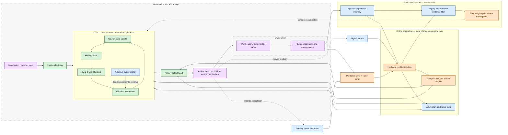

# Piro Stateful RL-First Model — v0.1

**Status:** design draft  
**Date:** July 20, 2026  
**Scope:** first architecture diagram for discussing state, delayed feedback,
and inference-time learning

## One-sentence thesis

Piro should not need a verifier after every action. It should preserve what it
expected, continue interacting with the environment, and let later consequences
update the earlier decisions that were actually eligible for credit.

## Diagram



## Reading the diagram

### 1. The black/green path is the model we already have

The current CTM prototype repeatedly updates neuron state, retains short-term
history, computes synchronization-driven attention, and emits an output after
one or more internal ticks. That is the part we can continue to benchmark today.

The exact current implementation is in `scratch/ctm_model.py`. The architecture
serializer in `piro/schema.py` is the existing mechanism for exposing model
structure to the Piro UI.

### 2. The blue path is per-task state, not permanent learning

The model needs state that changes while it is solving one task:

- **Belief state** — what the agent currently thinks is happening.
- **Plan/value state** — what it is trying to achieve and which futures look good.
- **Pending prediction record** — what it expected an action to cause.
- **Eligibility trace** — which recent decisions are still candidates for later
  credit.
- **Fast adapter** — optional small parameter/state changes that let the policy
  adapt during the task.

This state should be isolated by task, user, or environment. It must not be
silently shared between unrelated agents.

### 3. The orange path is delayed learning

The environment does not need to return a scalar reward immediately. It can
return ordinary observations and consequences. Piro compares those consequences
with its earlier predictions:

```text
prediction error = what happened - what was expected
value error      = future utility discovered - future utility predicted
```

The **hindsight credit attribution** stage asks which earlier actions likely
caused the discrepancy. It should combine temporal eligibility with causal or
counterfactual evidence instead of reinforcing every token in an episode equally.

### 4. Memory and weights have different jobs

The first version should keep these separate:

| Destination | What it stores | Timescale |
| --- | --- | --- |
| Belief / plan state | Current situation and active intent | ticks to minutes |
| Fast adapter | Temporary policy or world-model adaptation | one task/session |
| Episodic memory | Concrete action → consequence experiences | sessions to months |
| Slow weights | Repeated, generalizable patterns | periodic training |

The model should not immediately rewrite its durable weights after one surprising
outcome. A repeated-evidence filter and replay stage should be able to reject,
merge, or reverse weak updates.

## Current versus proposed components

| Component | Status | First implementation question |
| --- | --- | --- |
| Input embedding and output head | Implemented | How do we move from embedding classification to token/action generation? |
| CTM neuron state and repeated ticks | Implemented | Does deeper internal ticking improve held-out reasoning? |
| History and sync-driven attention | Implemented | What state should survive between ticks versus episodes? |
| Adaptive tick controller | Designed | Can confidence or prediction uncertainty choose compute depth? |
| Belief/value state | Designed | Is this a recurrent latent state, explicit tokens, or both? |
| Pending prediction records | Designed | What should be predicted: observations, utility, or both? |
| Eligibility traces | Designed | Which trace representation is stable for token-level actions? |
| Hindsight credit attribution | Designed | Can we learn useful attribution without an external verifier? |
| Fast policy/world-model adapter | Designed | Should this be fast weights, LoRA, or a recurrent memory module? |
| Episodic experience memory | Designed | What is the write policy and retrieval key? |
| Slow consolidation | Designed | What evidence threshold promotes an experience into durable learning? |

## Proposed first experiment

Do not begin with a full language model or full online weight mutation. Start
with a small environment where consequences are delayed but measurable:

1. The model chooses an action from a compact action space.
2. It predicts the next observation and eventual utility.
3. The environment returns observations, not an immediate correctness label.
4. The model maintains an eligibility trace over recent actions.
5. A later consequence updates a task-local fast adapter.
6. We compare against:
   - no adaptation,
   - immediate reward-only adaptation,
   - full-episode reward assigned uniformly,
   - and an oracle verifier.

The first success criterion is not raw benchmark score. It is whether the model
learns the right earlier action more reliably than the uniform-credit baseline,
while recovering when the environment changes.

## Design questions for feedback

1. Should Piro's first fast learner update **policy state**, a small **adapter**,
or a dedicated **world-model memory**?
2. Should the CTM tick loop be the place where belief/value state lives, or should
those be explicit parallel modules around the CTM?
3. What is the smallest environment that feels like a real Piro task rather than
a toy verifier?
4. How much of an experience should be visible to the future model: raw history,
a compressed memory, or a learned prediction record?

These are intentionally left open. This document is a discussion surface, not a
claim that the proposed online-learning path is already implemented.
